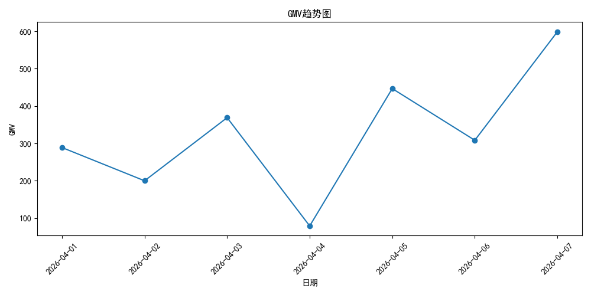
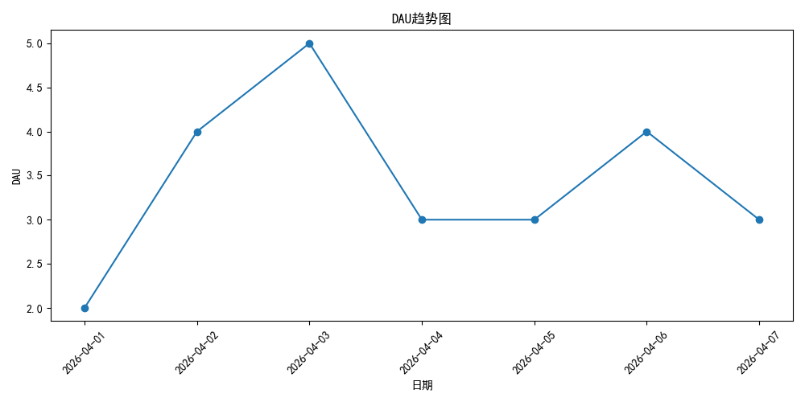
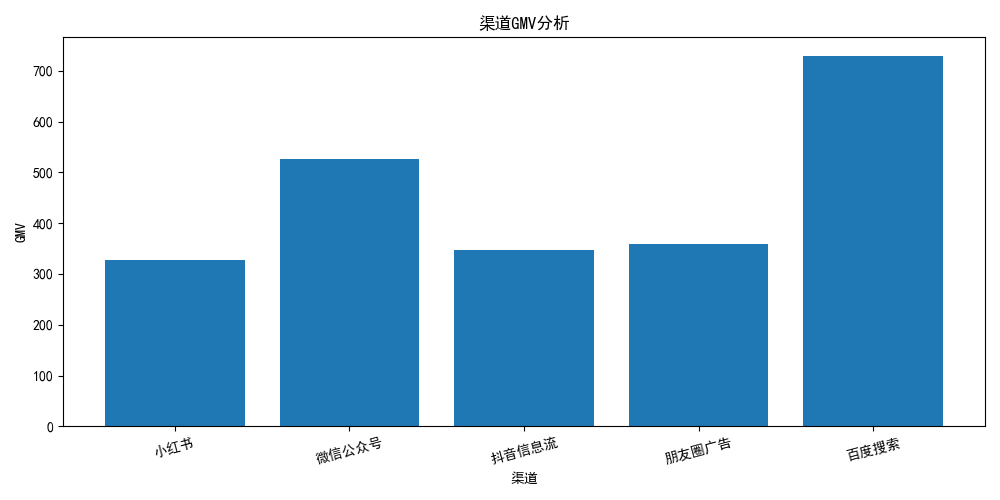

# Growth Data Warehouse

一个基于 Python + MySQL 搭建的用户增长数据仓库项目，模拟电商业务场景，实现了从原始数据采集、ETL 清洗、数仓分层建模，到 Dashboard 可视化分析的完整数据链路。

---

## 项目背景

项目模拟电商平台中的用户行为日志、订单数据与用户信息数据，围绕用户增长与交易分析场景，搭建 ODS → DWD → DWS → ADS 四层数据仓库。

项目重点包括：

* 用户行为分析
* 用户留存分析
* 漏斗转化分析
* 渠道转化分析
* GMV 营收分析
* 数据质量校验
* Dashboard 可视化展示

---

## 技术栈

* Python
* Pandas
* MySQL
* SQLAlchemy
* PyMySQL
* Matplotlib

---

## 项目结构

```text
growth-data-warehouse/
│
├── data/                  # 原始CSV数据
├── etl/                   # ETL脚本
├── infra/                 # 数据库连接与建表
├── warehouse/             # 数仓SQL
│   ├── ods/
│   ├── dwd/
│   ├── dws/
│   └── ads/
│
├── dashboard/             # Dashboard图表生成
├── logs/                  # ETL日志
├── README.md
└── requirements.txt
```

---

## 数仓分层设计

### ODS（原始数据层）

存储原始用户、订单与行为日志数据。

### DWD（明细数据层）

完成：

* 去重
* 异常值过滤
* 字段标准化
* 数据清洗

### DWS（主题聚合层）

沉淀核心业务指标：

* DAU
* GMV
* 留存率
* 页面PV/UV
* 漏斗转化
* RFM用户价值模型

### ADS（应用数据层）

面向 Dashboard 与业务分析输出结果数据。

---

## 核心指标

| 指标                | 含义     |
| ----------------- | ------ |
| DAU               | 日活用户数  |
| GMV               | 成交总金额  |
| Retention Rate    | 次日留存率  |
| Funnel Conversion | 漏斗转化   |
| RFM               | 用户价值模型 |

---

## Dashboard 展示

### GMV趋势图



### DAU趋势图



### 渠道GMV分析



---

## 项目亮点

* 基于 ODS-DWD-DWS-ADS 实现完整数仓分层
* 使用 Python + Pandas 完成 ETL 数据同步
* 实现日志记录与数据质量校验
* 构建用户增长指标体系
* 使用 Matplotlib 输出业务 Dashboard
* 项目支持模块化运行与工程化目录结构

---

## 项目启动

### 安装依赖

```bash
python -m pip install -r requirements.txt
```

### 初始化数据库

```bash
python -m infra.create_tables
```

### 导入ODS数据

```bash
python -m etl.load_ods
```

### 执行数仓ETL

```bash
python -m etl.main
```

### 生成Dashboard

```bash
python -m dashboard.main
```

---

## 项目架构

```text
CSV Data
   ↓
ODS（原始层）
   ↓
DWD（清洗明细层）
   ↓
DWS（指标聚合层）
   ↓
ADS（业务应用层）
   ↓
Dashboard
```
